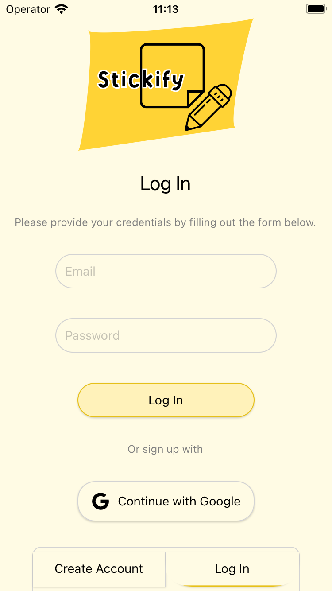

## Hi there!
💾 I am Software developer growing in Js (React) and Python (Django)

💾 Computer Science Student

### Areas of Expertise: 

*🌐 Mobile App Development*
*🌐 Backend*
*🌐 Frontend*

## Current Project
### 📝 [Stickify](https://github.com/opielapatryk/StickifyFireBase)
*React Native* | *Firebase* | *Jest*

Stickify is a user-friendly application designed to streamline the process of leaving and sharing notes with friends, providing a centralized space for collecting important information. Whether it's a quick reminder, a to-do list, or a shared idea, Stickify ensures that all your notes are conveniently stored in one accessible place.Stickify is a user-friendly application designed to streamline the process of leaving and sharing notes with friends, providing a centralized space for collecting important information. Whether it's a quick reminder, a to-do list, or a shared idea, Stickify ensures that all your notes are conveniently stored in one accessible place.

## Previous Projects
### 📝 [Stickify for Browser](https://github.com/opielapatryk/StickifyBackendDjango)
*Django* | *Django Rest Framework* | *PostgreSQL*

