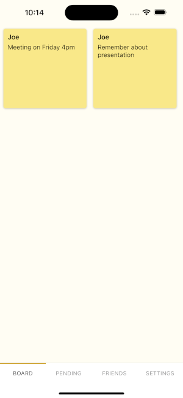
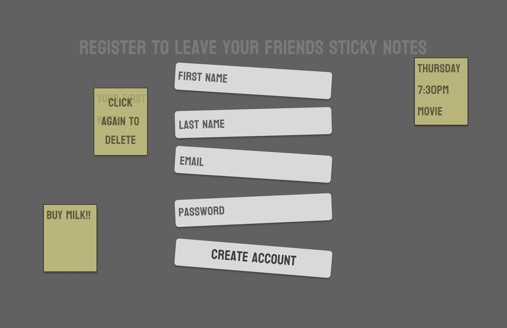

## Hi there!
### I am computer science student, intrested in: 
*🌐 Mobile App Development*   
*🌐 Backend*  

## Current Project
### 📝 [PeaNote](https://github.com/opielapatryk/StickifyFireBase)
*React Native* | *Firebase* | *Jest*

PeaNote is a user-friendly application designed to streamline the process of leaving and sharing notes/tasks with friends, providing a centralized space for collecting important information. Whether it's a quick reminder or a shared idea, PeaNote ensures that all your notes are conveniently stored in one accessible place.

## Previous Projects
### 📝 [PeaNote for Browser](https://github.com/opielapatryk/StickifyBackendDjango)
*Django* | *Django Rest Framework* | *PostgreSQL*

